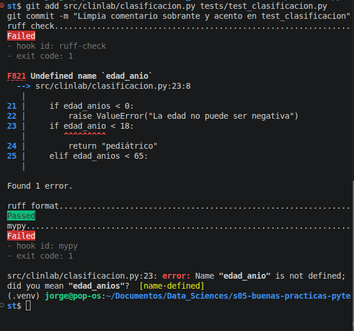
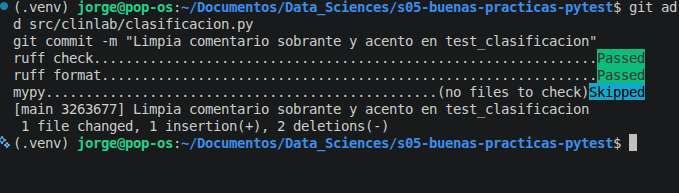

# Evidencia de pre-commit: commit rechazado → corregido → aceptado

Configuración: `.pre-commit-config.yaml` (ruff-check con `--fix`, ruff-format
y mypy sobre `src/`). Hook instalado con `pre-commit install`.

Para generar esta evidencia se hizo un cambio legítimo en
`tests/test_clasificacion.py` (borrar un comentario sobrante y un acento en un
`id`) y, a propósito, un error de tipeo realista en
`src/clinlab/clasificacion.py`, línea 23: `edad_anio` en vez de `edad_anios`.

## 🔴 Commit rechazado

- **ruff check** falla con `F821 Undefined name 'edad_anio'`, señalando la
  línea exacta. Es un error que `--fix` no puede arreglar solo: ruff no puede
  adivinar qué nombre se quiso escribir.
- **ruff format** pasa: el error no es de estilo.
- **mypy** también falla (`[name-defined]`) y hasta sugiere el nombre
  correcto (`did you mean "edad_anios"?`). Dos herramientas distintas
  atrapan el mismo error sin ejecutar el código (análisis estático).
- El commit **no se creó**: `git log` seguía mostrando el commit anterior.
  Sin el hook, este código habría entrado al historial y fallado recién al
  ejecutarse, con un `NameError`.

## 🟢 Corregido y aceptado

Tras volver a `edad_anios`, el commit pasa y se crea (`3263677`). Solo quedó
guardado el cambio legítimo: el error nunca llegó al historial.

Nota: mypy aparece como `Skipped (no files to check)`. Pre-commit revisa solo
los archivos **staged**, y al corregir el error `clasificacion.py` volvió a ser
idéntico al último commit, así que el único archivo del commit era
`tests/test_clasificacion.py`, que está fuera del alcance de mypy
(`files: ^src/`).
